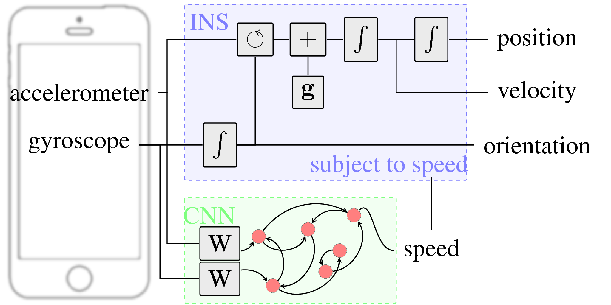

## Sumary

Strapdown inertial navigation systems are sensitive to the quality of the data provided by the accelerometer and gyroscope. Low-grade IMUs in handheld smart-devices pose a problem for inertial odometry on these devices. We propose a scheme for constraining the inertial odometry problem by complementing non-linear state estimation by a CNN-based deep-learning model for inferring the momentary speed based on a window of IMU samples.



## Dependencies:

Ubuntu 16.04 an python 2.7 (including numpy and matplotlib) were used in all the tests.

The following Python packages were also used
* [pytorch](https://pytorch.org/) (0.3)
* [pandas](https://pandas.pydata.org/) (0.23)

## Download and prepare training data

Download and unzip ADVIO dataset files
[ADVIO](https://github.com/AaltoVision/ADVIO)

```
cd data
for i in $(seq -f "%02g" 1 23);
do
  wget -O advio-$i.zip https://zenodo.org/record/1321157/files/advio-$i.zip
  unzip advio-$i.zip
  rm advio-$i.zip	
done
cd ..
```
Synchronize the accelerometer and gyroscope in the ADVIO data.

```
cd python
python sync-data.py
```

## Produce results

```
cd python
python DCI-training-0.0.2.py

```

License
--

This software is distributed under the GNU General Public License (version 3 or later); please refer to the file `LICENSE.txt`, included with the software, for details. 
